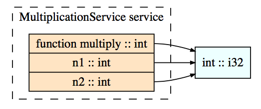
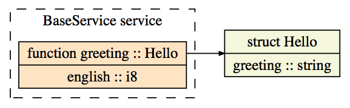

# Thrift sample

Just run `make thrift`

@see this quick tutorial http://www.thrift.pl/

- [First paper](https://thrift.apache.org/static/files/thrift-20070401.pdf)
- [Thrift Apache documentation](https://thrift.apache.org/docs/)
- [Thrift documentation](http://thrift-tutorial.readthedocs.io/en/latest/intro.html)
- [Thrift concepts](https://thrift.apache.org/docs/concepts)
- [Thrift exemples](https://github.com/apache/thrift/tree/master/lib/rb/spec)
- [Quora](https://www.quora.com/In-simple-terms-what-is-Thrift-software-framework-and-what-does-it-do)

The code generation exemple will implement a simple multiplication service :

And an Hello world service :

